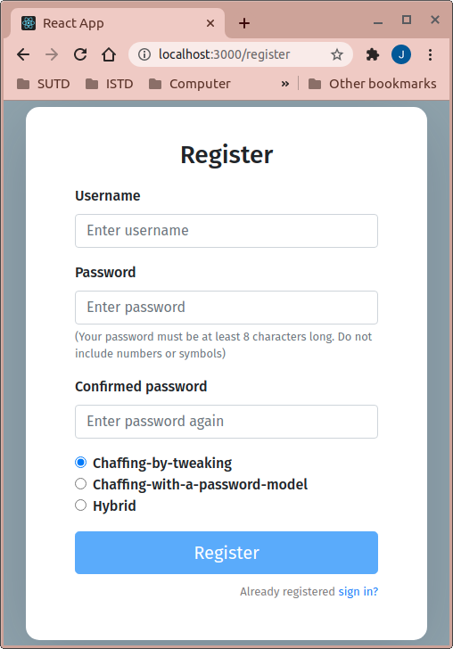
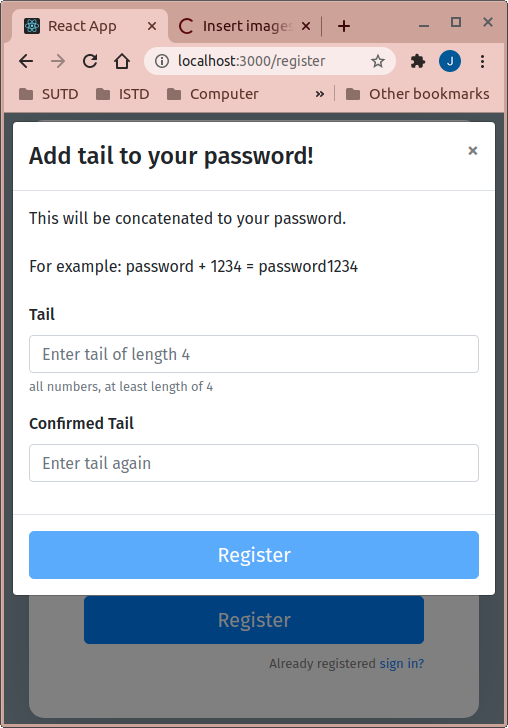
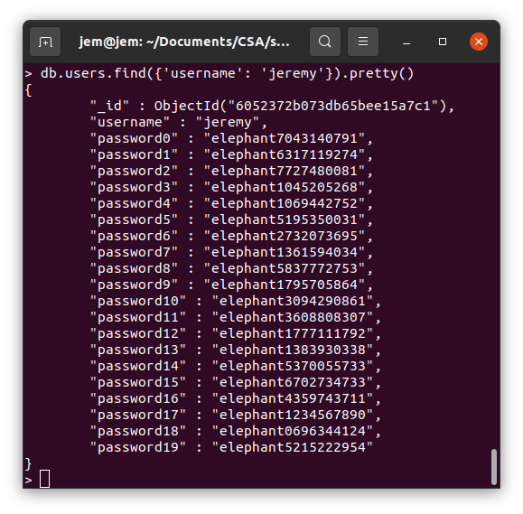
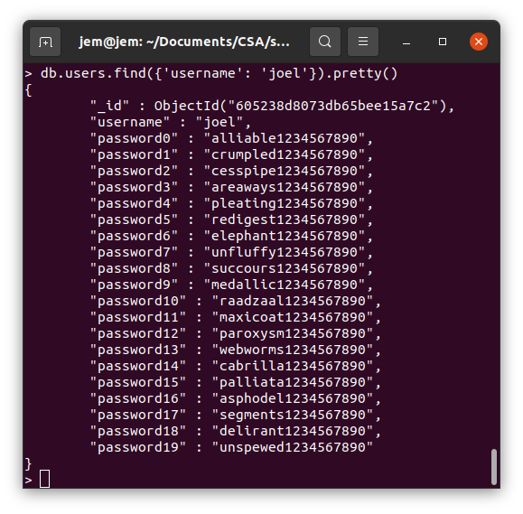
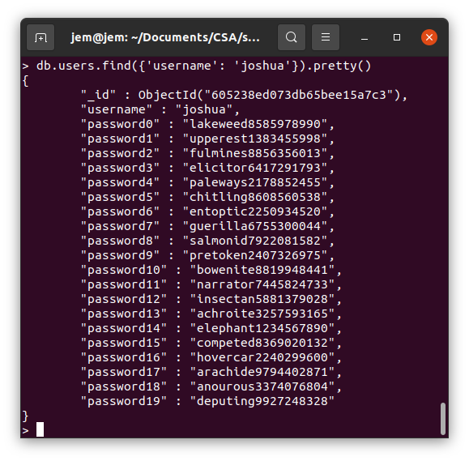
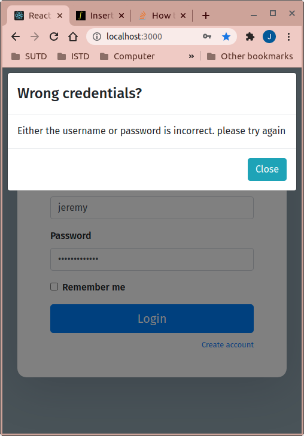
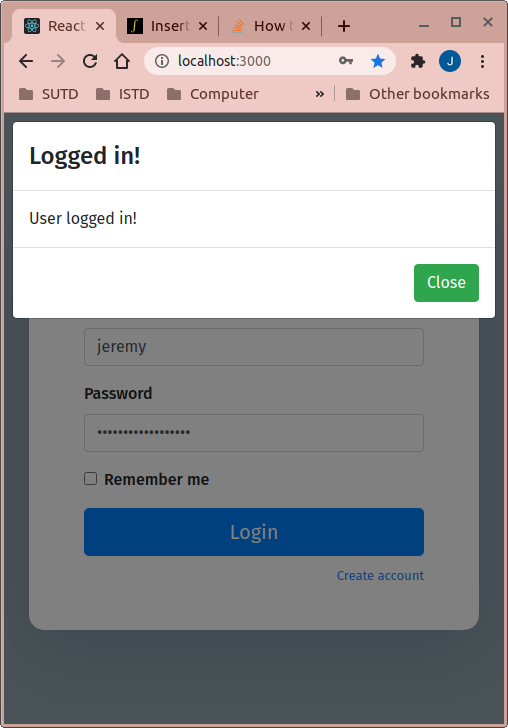
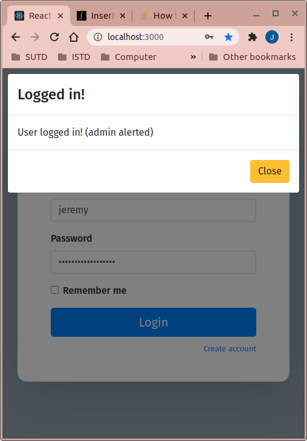

# System Security Homework 6 Backend

## Contributors

Jeremy, Wan Ching, Joel, Joshua, Heng yu

## Engine

Flask

## Terminologies

1. Honeyword = generated password based on the true password (also called the sugarword)
2. Sugarword = true password, as input by the actual user
3. Sweetwords = list of honeywords + sugarword

## Replicate demonstration

1. First, identify your project working directory. This is called `$PROJECT_DIR`
2. Navigate to `$PROJECT_DIR` through terminal. Execute these commands:

   ```bash
   $ git clone https://github.com/jeremyng123/syssec_hw6_flask.git
   $ git clone https://github.com/jeremyng123/syssec_hw6_react.git
   ```

   The first link is the backend server (where this README is located)  
   The second link is the frontend server. The engine used to host the respective server is based on the suffix of the repository (flask for backend and react for frontend)

3. Navigate to the frontend dir with `cd syssec_hw6_react`, and type this command:

   ```bash
   $ npm install
   ```

   to install the dependencies

4. Host the frontend server on `localhost:3000` by running this command:
   ```bash
   $ npm start
   ```
   The website will open on your favorite browser automatically
5. Navigate to the backend dir with `cd ../syssec_hw6_flask`. Install/update your dependencies with this command:

   ```bash
   $ pip install -r requirements.txt --user
   ```

   If there are problems running the server, try `sudo pip` instead, without the `--user` flag.

6. Start the backend server with `python main.py`.

## About

This is the backend server. Also known as the Honeychecker.

This server will interact with the [frontend server](https://github.com/jeremyng123/syssec_hw6_react).

This server will host mongodb locally, in port 27017.

The honeychecker is able to perform 3 different methods to generate 19 different honeywords to acquire `K = 20` sweetwords.

The developers of this project **understands** that passwords should be hashed when stored in the database. However, for demonstration sake, it is much simpler to view the database (which we will) with plaintext passwords to appreciate the meaning of password flatness.

The 3 methodologies are as follows:

1. chaffing-by-tweaking
2. chaffing-with-a-password-model
3. hybrid

### chaffing-by-tweaking

This methodology describes tweaking random character or digit in the password. In this project, only take-a-tail method is adopted

#### take-a-tail

This describes the server prompting the user to 'add a tail' (in this case, just random numbers) of at least `t = 4` length.

The reason for such adoption is to ensure flatness.

### chaffing-with-a-password-model

This methodology describes replacing the word input by the user with another word extracted from the dictionary ([see here](./dict_words.py))

### hybrid

This methodology describes both replacing the word and tweaking the tail with random number, of the same length as what the user had input

## Using the app as a whole

1. When user navigates to the website, they will arrive straight to the login page:  
     
    Landing page of the app
2. Click on Create account for new users

     
   Registration page

3. The user may fill in the fields with their favorite values. In this demonstration, we will choose username: `balapoopi`, password: `elephant`, because Jeremy love Elephants. Later on, we will reveal the flatness of the passwords generated by the honeychecker with the different methodologies. In this demonstration, we shall continue with `chaffing-by-tweaking`.  
     
   Adding a tail to the password

4. The user is now prompted to add a tail longer than or equals to 4. The tail should only contain numerics. Once the user is satisfied with their tail, they may click on 'Register' to submit their new generated account to the server. Notice that the user should be oblivious to the process of the password generation. For this demonstration, `tail=1234567890` is used  
     
   Account generated, viewed in Mongo shell

5. See that the account has been created in Mongo shell. Since we know the credentials to the mongo shell, we will use this to look at how the Honeychecker is doing with the password generation. We can see that `chaffing-by-tweaking` works as all the passwords stored in the database have generated different numbers from the tail inputted previously (recall that `tail=1234567890`). Also notice that `password17` contains the correct password (recall that this is called sugarword) and all passwords in the sweetlist (password0 to `password19`), excluding `password17`, are honeywords.  
   However, by looking through the rest of the passwords in the sweetwords, the acute observer might notice that using `tail=1234567890` is oddly ordered, whilst 19 other passwords seemed out of place. Assuming a highly intelligent adversary, noticing such patterns is trivial and that adversary is almost certain to pick `password17`, `elephant1234567890` as the first attempt, without triggering the alarm.  
   Before proceeding to login the account, we shall look at how the passwords are generated using the other 2 methodologies, reusing the same password and the same tail:

   1. Chaffing-with-a-password-model:  
        
      See that in this methodology, only the word has been replaced with other word. Since we know that the password contains elephant, we know that `password6` is the sugarword. However, take notice that because the word we chose is a single word (i.e. `elephant`), it is not trivial for an adversary to look at the sweetwords and determine which password is the `sugarword`. Thus, we may conclude that due to the `flatness` of the passwords, the adversary has `1/20` chance to guess the sugarword.

   2. Hybrid:  
      
      See that in this methodology, both the word and the digits have been replaced and tweaked, respectively. However, the same problem persist as with the `chaffing-by-tweaking` methodology due to the ordered digits that are present in the sugarword. Similarly, an adversary is almost certain to pick `password14` due to the ordered digits that was present at the tail.

   3. Conclusion of the methodologies:
      It seems that if a user inputs a long tail, the less likely passwords generated are flat. Also, we have not demonstrated the passwords generated when the user inputs **2 words** in camel case (i.e., `HelloWorld`). In such case, it is obvious that using `chaffing-by-tweaking` would ensure flatness in the password generated. On the other hand, suppose the user used 1 long word for their password, as well as a long, but order, tail, then `chaffing-with-a-password-model` will ensure flatness. The only case that hybrid is preferred is when the user:
      1. inputs **ONE** word (with at least 8 characters)
      2. inputs seemingly random tail (i.e., `9438` or `0198387106943`). However, a long random tail is unlikely to be remembered. It should, thus, suffice for a short tail and a long, single word for `hybrid` mode.

6. Now, we attempt to login to `username=jeremy` account. A demonstration of 3 different outcomes will be displayed:

   1. Wrong credentials:  
        
      The server will not reveal to the adversary which field they got wrong. This protects the user base from getting revealed, which results in brute force attack

   2. Successful login:  
        
      This occurs when the user/adversary keys in the `sugarword` for password. The `honeychecker` then allows the user to login to their account

   3. Honeyword login:  
        
      This occurs when the adversary keys in the `honeyword` for password. The user should not be expected to forget their own tail and key in the `honeyword`'s tail either, since this generation is not revealed to the user. Hence, it should suffice to say that if a user attempts to login to an account with a honeyword, then the admin and the owner of that account should be immediately notified so that the admin may look at the logs, and that owner should change their password.

## Conclusion

Having a honeyword implemented is a fantastic idea, keeping in mind that all passwords should be hashed and/or encrypted before storing in the database meant that an adversary that may have exploited the server and obtained a set of hashes from multiple accounts will have to:

1.  break all the hashes in the sweetwords
2.  conclude which password index contains the sugarword
3.  at risk of `(k-1)/k` probability to getting caught

In recent development, users have also been recommended to increase the length of their password, while the character space of the passwords is no longer as important anymore (i.e., it is sufficient for password to be of `length=20` but only contains alphanumeric).

By enforcing the word length and the tail length, it is possible to strengthen the password bit entropy while increasing the difficulty of the game for the adversary to break.

Such implementation, thus, strengthens the security multifolds. Any hint of an adversary wrongly guessing the user's password will spark an investigation immediately and prompt the owner of that account to change their password.

## Further reads

[Honeywords: Making Password-cracking detectable](https://people.csail.mit.edu/rivest/pubs/JR13.pdf)
